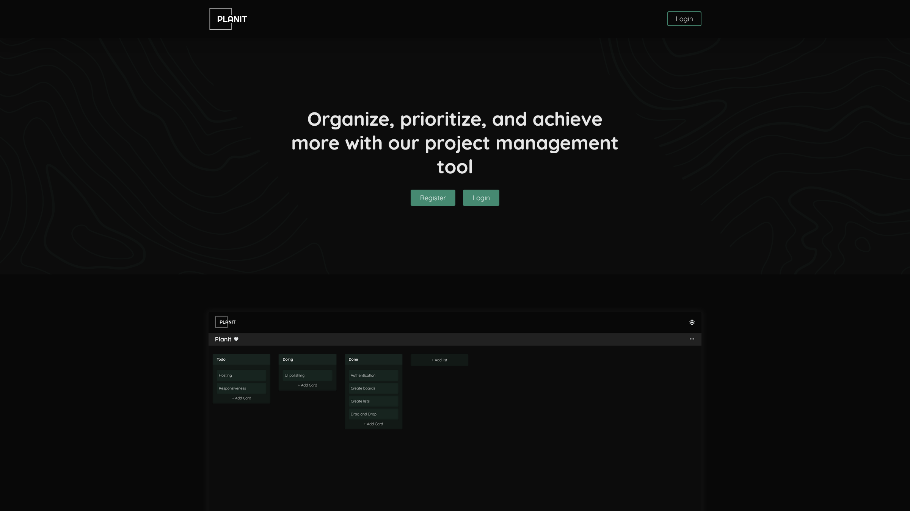
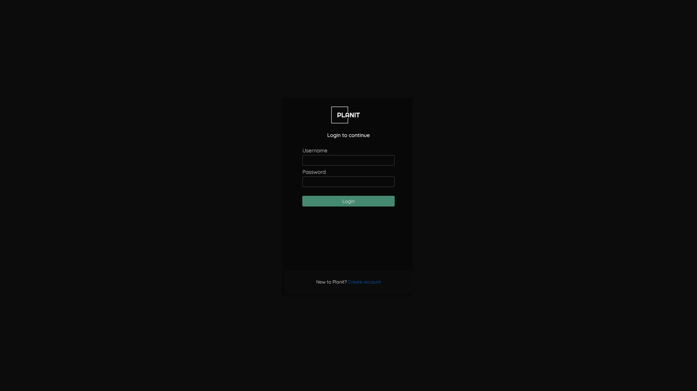
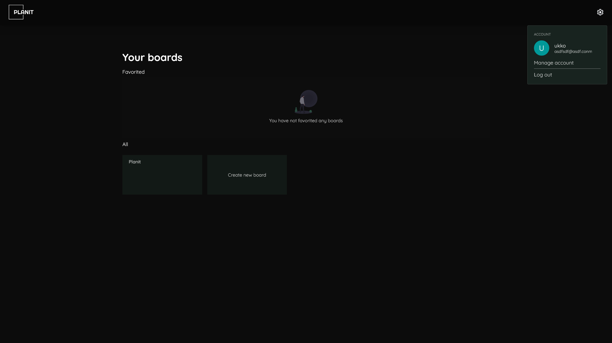
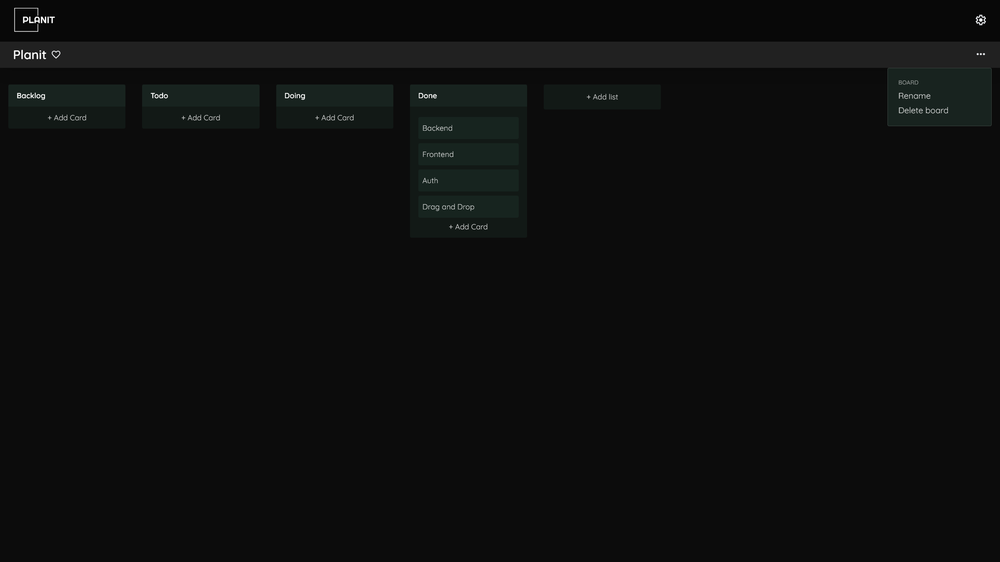
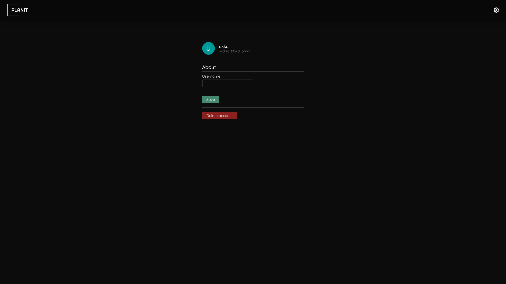

# Planit

> Organize, prioritize, and achieve more with our project management tool

## Features

- [x] 🔐 Authentication
  - [x] Register
  - [x] Login
  - [x] Logout
- [x] 🖼️ Boards
  - [x] Create board
  - [x] Edit board
  - [x] Favorite board
  - [x] Delete board
- [x] 📃 Lists
  - [x] Create a list
  - [x] Edit list
  - [x] Delete list
  - [x] Cards
    - [x] Create card
    - [x] Edit card
    - [x] Delete card
- [x] 🫳 Drag and drop
  - [x] Move lists
  - [x] Move cards
- [x] 🕴️ Manage account page

## Images

### Landing page



### Login page



### Boards page



### Board page



### Manage account page



## How to run

1. Clone repo

```
git clone https://github.com/leeviko/planit.git
```

2. Install client and server dependencies (make sure you have yarn)

```
// Run in client and server directory
yarn
```

3. In your server directory, make a copy of `.env.template` and rename it to `.env.local` and change the values

4. Run client and server using docker

```
docker compose up
```

5. After that the client should be running in `localhost:3000` and the server in `localhost:5000`
